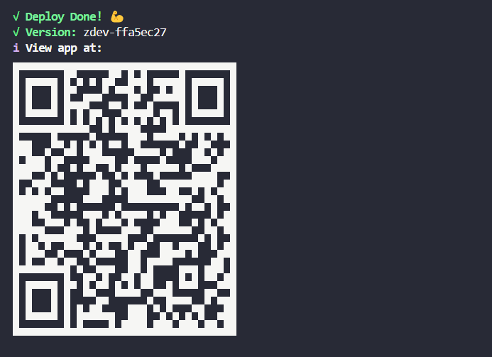
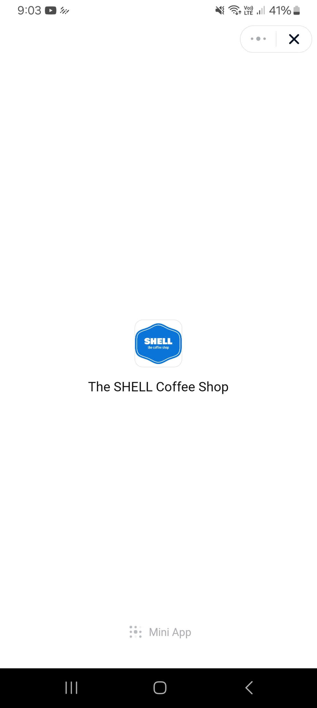
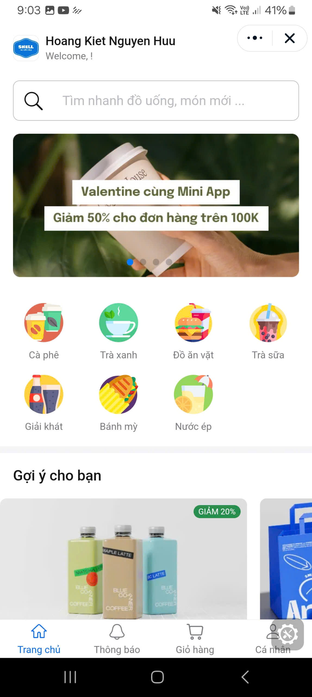
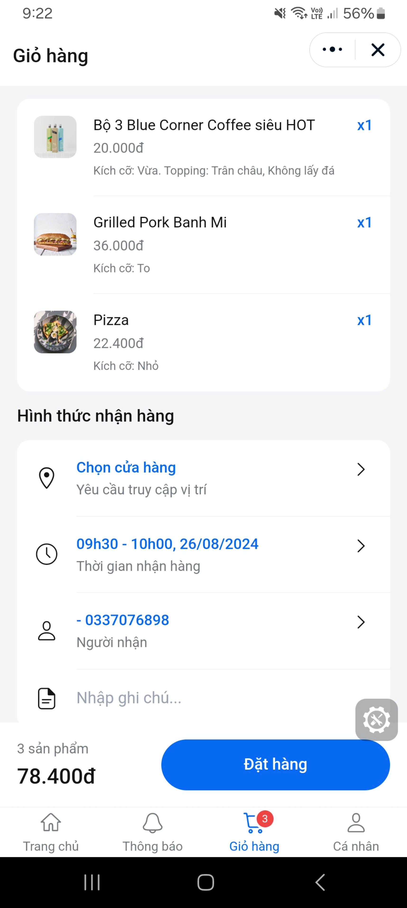

# Zalo-Mini-App-The-Practical-Guid


## Bắt đầu với Zalo Mini App

Trước khi phát triển 1 ứng dụng Zalo Mini App , bạn cần đăng kí và cấu hình ứng dụng Zalo Mini App của bạn. Hướng dẫn này sẽ giúp bạn khởi tạo và phát hành 1 ứng dụng Zalo Mini App một cách nhanh nhất.


## Môi trường phát triển

Để xây dựng ứng dụng Zalo Mini App, môi trường phát triển cần có:

Node.js: phiên bản >= 12.13.0 (có thể kiểm tra bằng lệnh node -v). Có thể dùng nvm để quản lý nhiều phiên bản Node.

## Khởi tạo Zalo App

Zalo App (không phải Zalo Mini App) là ứng dụng trên nền tảng Zalo, ứng dụng giúp tương tác với API OAuth và những API về dữ liệu khác trên nền tảng Zalo. Một Zalo App có thể chứa nhiều Zalo Mini App bên trong.

**Nếu bạn đã có Zalo App sẵn trong tài khoản của mình có thể bỏ qua bước này**

1. Tạo Zalo App: Truy cập [Zalo for Developer](https://developers.zalo.me/) và đăng nhập tài khoản Zalo của bạn. Sau đó tạo ứng dụng trên nền tảng Zalo Platform hoặc sử dụng 1 ứng dụng có sẵn.
2. Trong phần Cài đặt chọn Kích hoạt ứng dụng để người dùng bên ngoài có thể sử dụng ứng dụng của bạn.

## Khởi tạo Zalo Mini App

Để tạo Zalo Mini App mới, bạn vào [trang quản lý ứng dụng Zalo Mini App](https://mini.zalo.me/developers/), chọn Zalo App vừa tạo ở bước trên, nhấn Tạo Zalo Mini App và nhập các thông tin cần thiết.


Sau khi đã có Zalo Mini App trên hệ thống, bạn có thể bắt đầu phát triển Mini App bằng 2 cách sau:

1. Sử dụng Zalo Mini App Studio
2. Sử dụng Command line

## Tạo project bằng Studio

Để tạo Mini App bằng Zalo Mini App Studio, bạn chỉ cần tải phiên bản mới nhất của Studio tại đây. Sau đó, làm theo những hướng dẫn sau để tạo project và chạy Mini App ngay trên Zalo Mini App Studio:

1. [Tạo project mới](https://mini.zalo.me/devtools/ide/create-project/)
2. [Khởi động project](https://mini.zalo.me/devtools/ide/run-project/)
3. [Xuất bản project](https://mini.zalo.me/devtools/ide/deploy-project/)

## Tạo project bằng Command Line

Để bắt đầu phát triển ứng dụng Zalo Mini App, bạn có thể chạy lệnh sau:

```bash
npx create-zalo-mini-app my-app
cd my-app
npm start
```

Sau khi lệnh được thực thi, bộ [Zalo Mini App Cli](https://mini.zalo.me/devtools/cli/intro/) sẽ được tự động cài đặt hoặc cập nhật version mới nhất (nếu đã cài trước đó) và project my-app sẽ được khởi tạo.

Hoặc bạn cũng có thể tự cài đặt Zalo Mini App Cli và làm theo hướng dẫn bên dưới:

```base
npm install -g zmp-cli
```

### Với những dự án có sẵn muốn tích hợp Zalo Mini App

Để chuyển dự án có sẵn thành Zalo Mini App và phát hành trên Zalo, vui làm theo hướng dẫn:

1. Di chuyển terminal tới thư mục dự án của bạn và chạy lệnh:

```base
zmp init
```

2. Nhập Zalo Mini App ID (ID của MiniApp ứng dụng bạn vừa tạo).
3. Chọn phương thức đăng nhập để xác thực tài khoản.
4. Sau khi đăng nhập thành công chọn Using ZMP to deploy only, sau đó nhập tên ứng dụng của bạn để hoàn thành.

Hệ thống sẽ tự động tạo file app-config.json chứa thông tin cấu hình ứng dụng bạn.

### Với dự án xây dựng Zalo Mini App từ đầu

Để tạo mới dự án và tích hợp sẵn [ZaUI Component](https://mini.zalo.me/docs/zaui/), vui lòng làm theo hướng dẫn:

1. Tạo thư mục dự án và chạy lệnh:

```base
zmp init
```

2. Nhập Zalo Mini App ID (ID ứng dụng bạn vừa tạo).
3. Chọn phương thức đăng nhập để xác thực tài khoản.
4. Sau khi đăng nhập thành công chọn Create a new ZMP project, sau đó làm theo hướng dẫn để cấu hình dự án.

## Cấu Hình Zalo Mini App

[Read more](https://mini.zalo.me/intro/getting-started/app-config/)

## Chuyển đổi nhanh Web App có sẵn thành Zalo Mini App

[Read more](https://mini.zalo.me/intro/convert-web-app-to-zalo-mini-app/)

## Deploy Zalo Mini App Development

Ứng dụng đã được khởi động trên Zalo App, cho phép bạn xem trước trên thiết bị di động bằng cách quét mã QR.



---

**Hình ảnh từ Zalo Mini App**

<div style="display: flex; justify-content: space-between;">
  
  
  
</div>

---

Trong quá trình phát triển ứng dụng, việc triển khai phiên bản Development là bước quan trọng giúp bạn kiểm tra, thử nghiệm và đảm bảo rằng mọi tính năng hoạt động như mong đợi trước khi phát hành chính thức. Dưới đây là các bước để triển khai phiên bản Development của ứng dụng.

-   **Bước 1: Chuẩn bị Môi trường Development**

    Trước khi triển khai, hãy đảm bảo rằng bạn đã thiết lập đầy đủ môi trường development trên máy tính của mình, bao gồm các công cụ cần thiết như Node.js, zmp-cli, và Zalo App.

-   **Bước 2: Cài đặt Dependencies**

    Chạy lệnh dưới đây để cài đặt tất cả các dependencies cần thiết:

    ```bash
    npm install
    ```

-   **Bước 3: Khởi chạy Ứng dụng**

    ```bash
    npm run start
    ```
